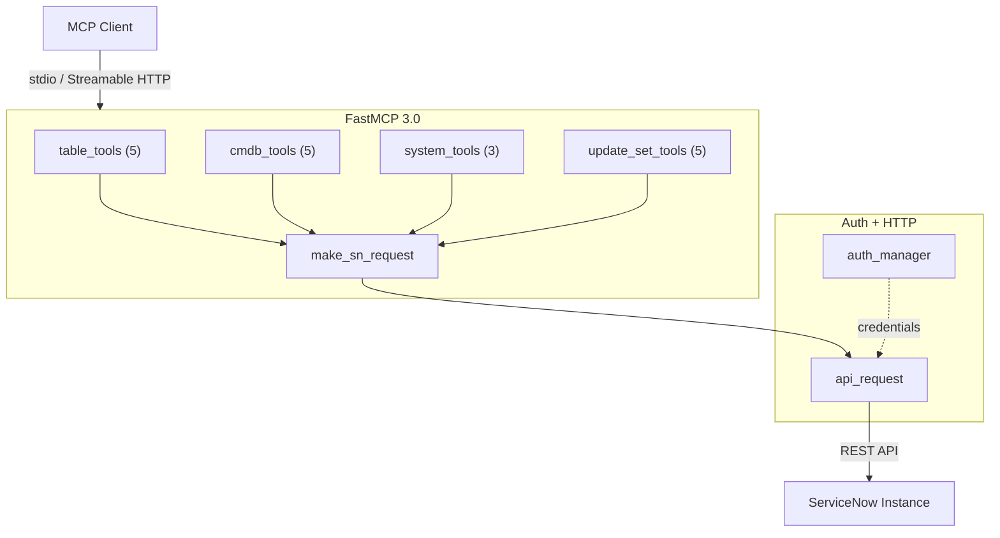

<!-- mcp-server: servicenow | tools: 18 | transport: stdio,streamable-http | auth: basic,oauth,api_key | framework: fastmcp-3.0 -->

<p align="center">
  
</p>

<h1 align="center">ServiceNow MCP Server</h1>

<p align="center">
  <a href="https://pypi.org/project/mcp-server-servicenow/"></a>
  <a href="https://www.python.org/"></a>
  <a href="https://gofastmcp.com"></a>
  <a href="#available-tools"></a>
  <a href="https://modelcontextprotocol.io"></a>
  <a href="LICENSE"></a>
  <a href="https://github.com/jschuller/mcp-server-servicenow/actions/workflows/ci.yml"></a>
  <a href="https://pypi.org/project/mcp-server-servicenow/"></a>
</p>

<p align="center">
  Connect Claude AI to ServiceNow. 18 MCP tools for incidents, CMDB, update sets, and more —<br>
  accessible from Claude Desktop, Claude Code, or any MCP client over stdio or Streamable HTTP.
</p>

---

`Table API` · `CMDB` · `Update Sets` · `System Properties` · `OAuth 2.1+PKCE` · `Streamable HTTP` · `Claude Code Plugin` · `4 Skills`

## What This Does

This MCP server lets AI assistants interact directly with a ServiceNow instance. Instead of copy-pasting between ServiceNow and your AI tool, Claude can query incidents, create records, explore CMDB relationships, and manage update sets through natural conversation.

Built with [FastMCP 3.0](https://gofastmcp.com) for decorator-based tool definitions and dual transport support.

## Native vs Community

ServiceNow shipped a native MCP Server in Zurich (2025). Here's when to use each:

| | Native (Zurich+) | This project |
|---|---|---|
| **SN version** | Zurich+ only | Any version (Tokyo+) |
| **Entitlement** | Requires Now Assist SKU | None (MIT, free) |
| **Auth model** | OAuth 2.1 + PKCE via AI Control Tower | OAuth 2.1 + PKCE via FastMCP proxy |
| **Governance** | AI Control Tower policies | Self-managed |
| **Table access** | Governed by CT config | Full table API access |
| **AI models** | Now Assist models + approved | Any MCP client (Claude, GPT, etc.) |
| **Custom tools** | Requires SN development | Python — add tools in minutes |

**Use native** if you're on Zurich+ with Now Assist and need AI Control Tower governance.
**Use this** if you're on an older version, don't have the entitlement, need custom table access, or want to use any AI model.

## Getting Started

### 1. Get a ServiceNow Instance

Sign up for a free [Personal Developer Instance (PDI)](https://developer.servicenow.com/) — it comes pre-loaded with demo data. Wake it from the developer portal if it's hibernating.

### 2. Install

```bash
# From PyPI (recommended)
pip install mcp-server-servicenow

# Or run directly with uvx (no install needed)
uvx mcp-server-servicenow --help
```

### 3. Configure Your MCP Client

Copy `.mcp.json.example` to `.mcp.json` and fill in your credentials, or use the Claude Code CLI:

```bash
claude mcp add servicenow -- uvx mcp-server-servicenow \
  --instance-url https://your-instance.service-now.com \
  --auth-type basic --username admin --password your-password
```

### 4. Verify

Ask Claude: "List the 5 most recent incidents" — if it returns data, you're connected.

### From Source

```bash
git clone https://github.com/jschuller/mcp-server-servicenow.git
cd mcp-server-servicenow
pip install -e .

# Run with stdio (Claude Desktop / Claude Code)
mcp-server-servicenow \
  --instance-url https://your-instance.service-now.com \
  --auth-type basic \
  --username admin \
  --password your-password

# Or run with HTTP (remote access / Cloud Run)
mcp-server-servicenow \
  --transport streamable-http \
  --port 8080 \
  --instance-url https://your-instance.service-now.com \
  --auth-type basic \
  --username admin \
  --password your-password
```

## Available Tools

### Table API (5 tools)
| Tool | Description |
|------|-------------|
| `list_records` | List records from any table with filtering, field selection, and pagination |
| `get_record` | Get a single record by sys_id |
| `create_record` | Create a new record in any table |
| `update_record` | Update an existing record |
| `delete_record` | Delete a record by sys_id |

### CMDB (5 tools)
| Tool | Description |
|------|-------------|
| `list_ci` | List configuration items with class and query filtering |
| `get_ci` | Get a single CI by sys_id |
| `create_ci` | Create a new configuration item |
| `update_ci` | Update a configuration item |
| `get_ci_relationships` | Get parent/child relationships for a CI |

### System (3 tools)
| Tool | Description |
|------|-------------|
| `get_system_properties` | Query system properties |
| `get_current_user` | Get authenticated user info |
| `get_table_schema` | Get table data dictionary (field definitions) |

### Update Sets (5 tools)
| Tool | Description |
|------|-------------|
| `list_update_sets` | List update sets with state filtering |
| `get_update_set` | Get update set details |
| `create_update_set` | Create a new update set |
| `set_current_update_set` | Set the active update set |
| `list_update_set_changes` | List changes within an update set |

## Architecture



## Configuration

Add to your MCP client config — copy the snippet for your tool:

<details>
<summary><strong>Claude Code</strong></summary>

```bash
claude mcp add servicenow -- uvx mcp-server-servicenow \
  --instance-url https://your-instance.service-now.com \
  --auth-type basic --username admin --password your-password
```
</details>

<details>
<summary><strong>Claude Desktop</strong></summary>

Add to `~/Library/Application Support/Claude/claude_desktop_config.json`:
```json
{
  "mcpServers": {
    "servicenow": {
      "command": "uvx",
      "args": ["mcp-server-servicenow"],
      "env": {
        "SERVICENOW_INSTANCE_URL": "https://your-instance.service-now.com",
        "SERVICENOW_AUTH_TYPE": "basic",
        "SERVICENOW_USERNAME": "admin",
        "SERVICENOW_PASSWORD": "your-password"
      }
    }
  }
}
```
</details>

<details>
<summary><strong>Cursor / VS Code</strong></summary>

Add to `.cursor/mcp.json` or `.vscode/mcp.json`:
```json
{
  "mcpServers": {
    "servicenow": {
      "command": "uvx",
      "args": ["mcp-server-servicenow"],
      "env": {
        "SERVICENOW_INSTANCE_URL": "https://your-instance.service-now.com",
        "SERVICENOW_AUTH_TYPE": "basic",
        "SERVICENOW_USERNAME": "admin",
        "SERVICENOW_PASSWORD": "your-password"
      }
    }
  }
}
```
</details>

See [Configuration Guide](docs/configuration.md) for OAuth, multi-instance, and the full environment variable reference.

## Deployment

See [Deployment Guide](docs/deployment.md) — Docker, Cloud Run, HTTP transport verification, and the security model.

## Troubleshooting

See [TROUBLESHOOTING.md](TROUBLESHOOTING.md) for common issues (hibernating instances, 401 errors, OAuth).

## Development

```bash
# Install with dev dependencies
pip install -e ".[dev]"

# Run unit tests
python -m pytest tests/ -v --ignore=tests/integration

# Run integration tests (requires PDI credentials)
SERVICENOW_INSTANCE_URL=https://your-pdi.service-now.com \
SERVICENOW_USERNAME=admin \
SERVICENOW_PASSWORD=your-password \
python -m pytest tests/integration/ -v

# Lint
ruff check src/ tests/
```

## Skills (Claude Code)

This project ships 4 Claude Code skills in `.claude/skills/` — guided workflows that chain MCP tools for common ServiceNow tasks. Skills auto-trigger from natural conversation or can be invoked directly.

| Skill | What It Does | Try Saying |
|-------|-------------|------------|
| **servicenow-cmdb** | CI classes, dependencies, CMDB health, data quality, CSDM compliance | "show me CMDB health" / "what depends on this server" |
| **exploring-tables** | Schema discovery, field types, data profiling, table comparison | "what fields does incident have" / "find tables matching cmdb" |
| **reviewing-update-sets** | Update set review, risk flagging, conflict detection, pre-promotion checks | "review my update sets" / "is this safe to promote" |
| **triaging-incidents** | Incident triage, priority assessment, CI correlation, bulk analysis | "what's on fire" / "open P1 incidents" |

The **update set reviewer** is a unique differentiator — no other open-source ServiceNow MCP server provides guided update set review workflows with risk categorization and pre-promotion checklists.

## Claude Code Plugin

Install as a Claude Code plugin for zero-config setup — the MCP server, skills, slash commands, and admin agent are bundled together.

### Prerequisites

Set these environment variables (or add them to your shell profile):

```bash
export SERVICENOW_INSTANCE_URL="https://your-instance.service-now.com"
export SERVICENOW_AUTH_TYPE="basic"  # or "oauth"
export SERVICENOW_USERNAME="admin"
export SERVICENOW_PASSWORD="your-password"
# For OAuth only:
export SERVICENOW_CLIENT_ID="your-client-id"
export SERVICENOW_CLIENT_SECRET="your-client-secret"
```

### Install from Git

```bash
claude plugin add --from https://github.com/jschuller/mcp-server-servicenow
```

### Install Locally (development)

```bash
claude --plugin-dir /path/to/mcp-server-servicenow
```

### Slash Commands

| Command | Description |
|---------|-------------|
| `/servicenow:triage` | Triage incidents — list, investigate, assess priority, analyze trends |
| `/servicenow:cmdb` | Explore CMDB — CI hierarchy, dependencies, health, CSDM taxonomy |
| `/servicenow:review-update-set` | Review update sets — deep review, compare, pre-promotion checks |
| `/servicenow:explore-table` | Explore tables — schema, fields, data profiling, table search |

### Agent

The `servicenow-admin` agent handles complex multi-step tasks autonomously (CMDB audits, incident trend reports, batch update set reviews). Claude can spawn it as a background worker for long-running analysis.

> **Note:** The plugin auto-configures the MCP server — no manual `.mcp.json` setup required.

## Roadmap

- **Phase 1** &#x2705; Foundation — 18 tools, OAuth retry, structured error handling
- **Phase 2** &#x2705; Remote access — FastMCP 3.0, Streamable HTTP, Cloud Run deployment
- **Phase 3** &#x2705; Security — OAuth 2.1 + PKCE proxy, per-user SN auth, matches native Zurich model
- **Phase 4** &#x2705; Skills & workflows — 4 Claude Code skills (CMDB, table explorer, update set reviewer, incident triage)
- **Phase 4.5** &#x2705; Plugin packaging — Claude Code plugin with slash commands, admin agent, zero-config install
- **Phase 5** &#x2705; Distribution — PyPI package, [MCP Registry](https://registry.modelcontextprotocol.io), automated publish workflows
- **Next** — Enhancement backlog under active consideration (background scripts, error enrichment, system logs, health checks)

## Related Projects

- **[sn-app-template](https://github.com/jschuller/sn-app-template)** — ServiceNow scoped app template for Claude Code + now-sdk. Pairs with this MCP server for AI-assisted development.

## License

[MIT](LICENSE)
